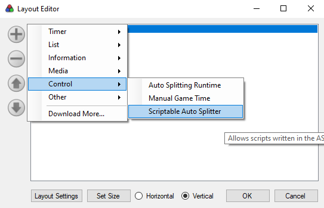

# Autosplitter for All SS Effect Modes
This autosplitter is designed to record RTA Without Loads for running Effect Modes All SS in Tetris Effect: Connected.

Big thanks to Jujstme for implementing sigscanning to find the base address dynamically in the Journey autosplitter, that code is reused here.
_________

### Adding the Autosplitter to LiveSplit
Unlike the Journey mode autosplitter, this autosplitter will not be automatically downloaded by LiveSplit, so you'll have to add it manually.
1. Right-click on your timer and go to Edit Layout.
2. Click on the plus, go to Control, and click on Scriptable Auto Splitter.
3. Once you add this to your layout, double click on it (or go to layout settings). There, you can browse to the .asl file to load the autosplitter.

    
_________

### Usage and Limitations
The autosplitter will start once you load into any level, and will split when you unload a level. That's pretty much it.

Retrying from the pause menu or from the results both reload the level. The autosplitter is able to detect when the level is unloaded from the pause menu, but not from the results screen. The autosplitter does not check for SS or which modes are played. Unlike the Journey autosplitter, this autosplitter isn't reading the timer due to differences in modes, therefore this times RTA Without Loads and not IGT. This also means there is a slight amount of inaccuracy caused by the delay in reading memory.
_________

### Known Issues:
- Timer counts past the end of All Clear - I'm not sure there's anything I can do about this immediately, as the bit flags I'm reading are just not set until quit.
- Timer counts past the end of Classic - I saw this one coming, and it will be possible to make a classic-specific timer halt. I should have all the info I need for that.

### Potential Upcoming Stuff:
- Electra found a byte that indicates what mode is loaded. This can be useful for a few things: Classic specific load detection, detecting retries, and potentially whether the game is loaded depending on its behavior. This would require some refactoring so I'm not doing this right away.
_________

### Troubleshooting:
Make sure you set your timer/splits to Game Time in LiveSplit's settings. Unlike the Journey mode autosplitter, this one isn't integrated into LiveSplit or speedrun.com so it won't be able to pick that up with Current Timing Method.

Other than that, the timer is a bit on the jank side so just contact me on here or discord (Adventium_#7299) if you notice anything weird.
